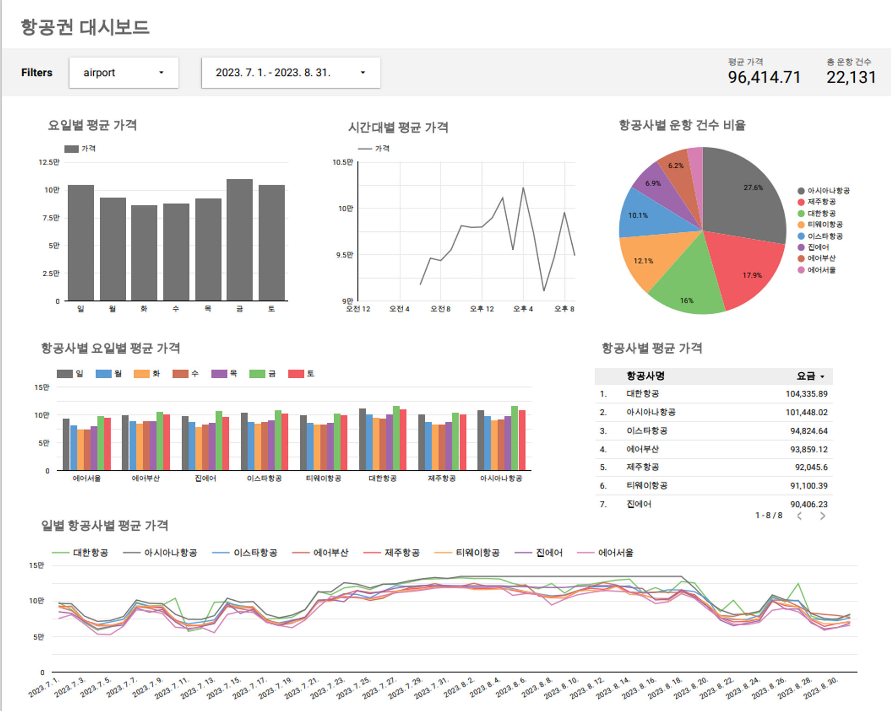

# 🍊김포-제주 극성수기 여행 경비 안내 웹 개발
프로젝트 기간 : 2023.05.15 ~ 2023.05.25

## 프로젝트 배경
제주도 여행 경비를 고려했을 때 고정적으로 발생하는 비용인 항공권, 숙박시설, 렌터카 요금을 합산한 금액을 간단하게 조회해볼 수 없을까 하는 의문과 아직은 항공권, 숙박, 렌터카 요금을 따로 보여주는 웹 서비스만 존재하기 때문에 이를 더 편리하게 하고자 합니다. 또한, 조사결과 2030 젊은 층은 해외여행을 선호하는 반면, 60대 이상 노년층은 국내에 더 관심 많았습니다. 가성비 여행을 찾는 2030 젊은 층의 국내 여행 증가를 위해 관광객들에게 저렴한 경비를 보다 편리하고 정확한 정보를 제공할 수 있는 서비스 필요성 때문에 해당 프로젝트를 진행하게 되었습니다. 국내 여행지 중 항공을 이용하여 여행을 가장 많이 가는 제주와 제주에서 출발하는 운항 중 가장 많은 도착지인 김포공항의 극성수기(7월~8월)로 범위를 선정하였습니다.

## 기술 스택& 담당 역할
- 담당업무 : ```파이프라인 구축 보조``` ```웹 서버 구축, 기능 구현 및 배포```
- skills : ```Python``` ```SQL``` ```Flask``` ```HTML``` ```JavaScript``` ```GCP(BigQuery, Looker)``` ```AWS EC2```
- 기술 스택 선택 이유
  - ```BigQuery``` : 필요에 따라 자동으로 확장되는 뛰어난 확장성과 데이터 분석가나 개발자들이 쉽게 접근하고 활용할 수 있는 간편한 사용성 때문에 선정.
  -  ```Flask```
      -  필요한 기능을 선택적으로 확장하거나 추가할 수 있고 프로젝트의 크기와 요구 사항에 맞게 유연하게 사용할 수 있후 스크래핑한 데이터는 데이터 프레임 형식으로 변환하고 가공하여 Bigquery 테이블에 적재.


## 프로젝트 수행절차  
1. 데이터 소개   
  * 항공권 데이터(김포<->제주)
    * Data shape : 9columns X 22131 rows
    * 출처 : [네이버 항공권 홈페이지](https://m-flight.naver.com/)
     
| 컬럼명 | 소개 | 컬럼명 | 소개 |
| --- | --- | --- | --- |
| date | 출발 날짜(YYYY-MM-DD) | leavehour | 출발 시간 |
| day | 요일 | reachtime | 도착 시각 |
| name | 항공사 이름 | seat | 좌석 종류(할인석, 일반석 등) |
| airport | 출발 공항지 | charge | 요금 |
| leavetime | 출발 시각 |  |  |

  * 호텔 데이터
    * Data shape : Data shape : 5columns X 1200 rows
    * 출처 : [네이버 호텔 홈페이지](https://hotels.naver.com/)
     
| 컬럼명 | 소개 | 컬럼명 | 소개 |
| --- | --- | --- | --- |
| name | 호텔명 | star | 별점 |
| address | 주소 | price | 가격 |
| rating | 평점 |  |  |

  * 렌터카 데이터
    * Data shape : Data shape : 10columns X 8236 rows
    * 출처 : 코드스테이츠
     
| 컬럼명 | 소개 | 컬럼명 | 소개 |
| --- | --- | --- | --- |
| id | 식별아이디 | seater | 좌석수 |
| carname | 차 종류 | year | 연도(str) |
| date | 날짜 | avg_year | 연도(int) |
| day | 요일 | regular_price | 정가 |
| diltype | 오일 타입 | discounted_price | 할인가 |

2. 파이프라인


## 서비스 구성과 제작 과정
1. 데이터 수집
    - selenium을 통한 동적 웹페이지 스크래핑.
    - 테이블 생성 후 스크래핑한 데이터는 데이터 프레임 형식으로 변환하고 가공하여 Bigquery 적재

2. 웹서버 구축과 페이지 구현
  * Flask를 사용하여 웹서버 구축.
  * Bootstrap 템플릿을 활용하여 페이지의 레이아웃과 디자인을 구성
  * Flask와 Jinja2 템플릿 엔진을 사용하여 Python과 Bootstrap을 연동하여 동적인 웹 페이지를 구현

3. 기능 소개
<table>
  <td>
    
    달력페이지
  </td>
  <td>
    
    목록페이지
  </td>
  <td>
    
    여행경비총합
  </td>
</table>

  - 달력 페이지(메인 페이지) 상세소개
      - 항공권의 일일 최저, 평균, 최고가에 대한 정보와 날짜 클릭 시 해당 날짜에 대한 데이터를 볼 수 있도록 페이지 이동.
      - 달력 구현을 위해 JavaScript와 JavaScript 라이브러리인 FullCalendar 사용.
      - Ajax로 DB를 json형식으로 받아와 Javscript 객체로 파싱한 후 서버로부터 날짜 별 항공권 최저가, 최고가, 평균가 정보 받아와서 달력 위에 출력.

  - 목록 페이지(항공권, 호텔, 렌터카) 상세소개
      - 달력을 통해서 목록 페이지로 이동할 수 있지만 직접 접근하는 경우 기본적으로 7월 1일 자의 항공권 목록과 호텔, 렌터카 목록을 가격 오름차순으로 보여줌으로써 최저가를 빠르게 찾을 수 있도록 구성.
      - 항공권 목록 : 날짜, 가격범위, 출발지 중 원하는 옵션을 선택하면 HTML form을 통해 서버로 전달되고, Flask는 전달된 값을 기반으로 BigQuery Database에 Query를 수행하여 조건에 맞는 데이터를 가져옴.
      - Query는 선택된 옵션을 조건으로 BigQuery에서 데이터를 검색하고, 검색결과를 다시 Flask로 전달하여 웹 페이지에 동적으로 출력.

  - 여행경비 총합 제공 상세소개
      - 항공권, 호텔, 렌터카에 대한 항목을 선택하게 되면 Javascript와 이벤트 리스너로 인해 여행 경비 총합을 계산하여 사용자에게 정보 제공.


4. 웹 배포
    - Ubuntu Linux 기반의 AWS EC2 인스턴스 생성.
    - 키페어 생성 및 권한 설정
        - 윈도우의 경우 키페어 속성 변경시 보안->고급을 클릭하여 관리자 그룹을 제외한 모든 그룹의 상속을 제거.
    - 키페어를 이용한 인스턴스 접속 후 필요 라이브러리 설치
    - 웹서버 실행 및 보안 그룹 설정
        - 포트 번호는 8080으로 설정.
    - HTTPS 적용
        - 기존에는 HTTP로 적용되어 있기 때문에 HTTPS로 변경.
        - 통신 보안을 위해 사설 인증서를 이용해서 개인 SSL 생성.
    - 고정 IP 사용을 위해 Elastic IP 할당.
    - URL : [https://3.34.140.217:8080/](https://3.34.140.217:8080/)
   
<br>

#### 2.4. 대시보드
<table>
  <td>
    
    항공권대시보드
  </td>
  <td>
    
    호텔대시보드
  </td>
  <td>
    
    렌터카대시보드
  </td>
</table>

* 항공권 대시보드
    * 출발공항과 기간 두가지의 필터 적용가능.
    * 전체 항공권 평균 가격과 총 운항 건수 정보 제공
    * 요일별 평균 가격 그래프에서 금요일의 평균 가격이 가장 높고 화요일의 평균 가격이 가장 낮은 것을 확인할 수 있음.
    * 시간대별 평균 가격 그래프에서는 오후 4시의 평균 가격이 높고 오후 6시의 평균 가격이 가장 낮은 것을 확인할 수 있었지만, 출발공항을 김포 또는 제주로 설정했을때 큰 차이가 나타남을 알 수 있음.   
* 호텔 대시보드
    * 주소와 호텔 등급에 따른 필터 적용가능
    * 전체적으로 제주시의 호텔 수가 많고, 가격이 낮은 것으로 보아 3성급 호텔이 가장 많음을 알 수 있음.
    * 별점에 따른 평균 가격 그래프에서는 비교적 낮은 평점 3점대의 호텔의 평균 가격이 가장 높은 것을 알 수 있는데 이는 높은 가격에 대해 더 질 좋은 서비스를 기대하여 조그마한 오점에도 크게 실망할 수 있는 소비자의 심리가 반영되었다고 추측.   
* 렌터카 대시보드
    * 연료 종류에 따른 필터 적용 가능
    * 전체 평균 정가, 평균 할인가, 총 렌터카 건수에 대한 정보 제공
    * 전체적으로 하이브리드 기종의 평균 가격이 가장 높고 LPG 기종의 평균 가격이 가장 낮은 것을 확인할 수 있음.
    * 또한 연식별 평균 할인을 그래프에서는 2015년식 차량의 할인율이 가장 높은 것을 확인할 수 있음.    

<br>

### 3. 한계점 및 개선사항
- 한계점
    - 목록페이지는 Ajax를 사용하여 기능 구현을 했지만, 달력페이지에서 목록페이지로 이동 시의 필터링 문제로 form을 사용.
    - 시간 부족으로 호텔 데이터 수집 시 날짜나 객실 정보 등 세부적인 데이터를 스크래핑 하지 못한 점.
    - 실시간 스트리밍을 하지 않아 데이터가 업데이트되지 않음.
- 개선사항
    - 사용자 측면에서 봤을 때 생각보다 입력해야 할 값이 많아서 이탈 가능성이나 피로감을 줄 수 있기 때문에 디자인 개선.
    - 항공권 정보는 가격 변동 등이 발생했을 때 실시간으로 사용자들에게 최신 정보를 제공하기 위해 실시간 처리가 필요함. Apache Kafka를 사용하여 데이터 수집 서버를 구축하고 실시간 스트리밍을 진행하여 데이터 업데이트.
